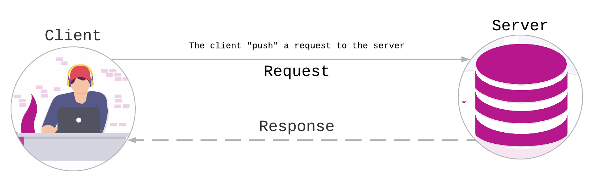
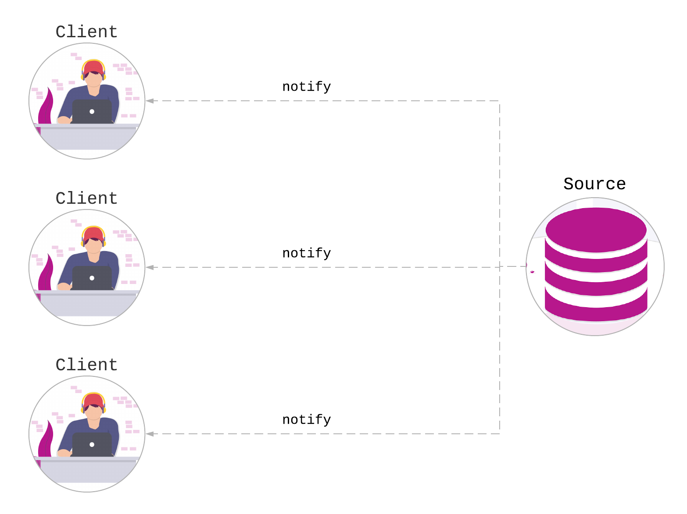

# Changing the paradigm - Part 1

Before start with ReactiveX we need to be aware about the mindset change that we need.

## 🧠 Pull vs Push architectures

### Pull architecture

The pull architecture refers to when the client "push" a request to the server. This is the most famous example: Client makes a data request to the server and the server response with the data. The main characteristic of this approach is **the client manually make the request.**

### Push architecture

Contrary to pull architectures, the push approach requires the client to wait for the notification from a source.

## Additional resources

* [Jeff Poole medium article](https://medium.com/@_JeffPoole/thoughts-on-push-vs-pull-architectures-666f1eab20c2)
* [RxJs course by Brian Troncome \(paid\)](https://ultimatecourses.com/learn/rxjs-basics)
*  [Thomas Burleson medium article](https://medium.com/@thomasburlesonIA/push-based-architectures-with-rxjs-81b327d7c32d)

