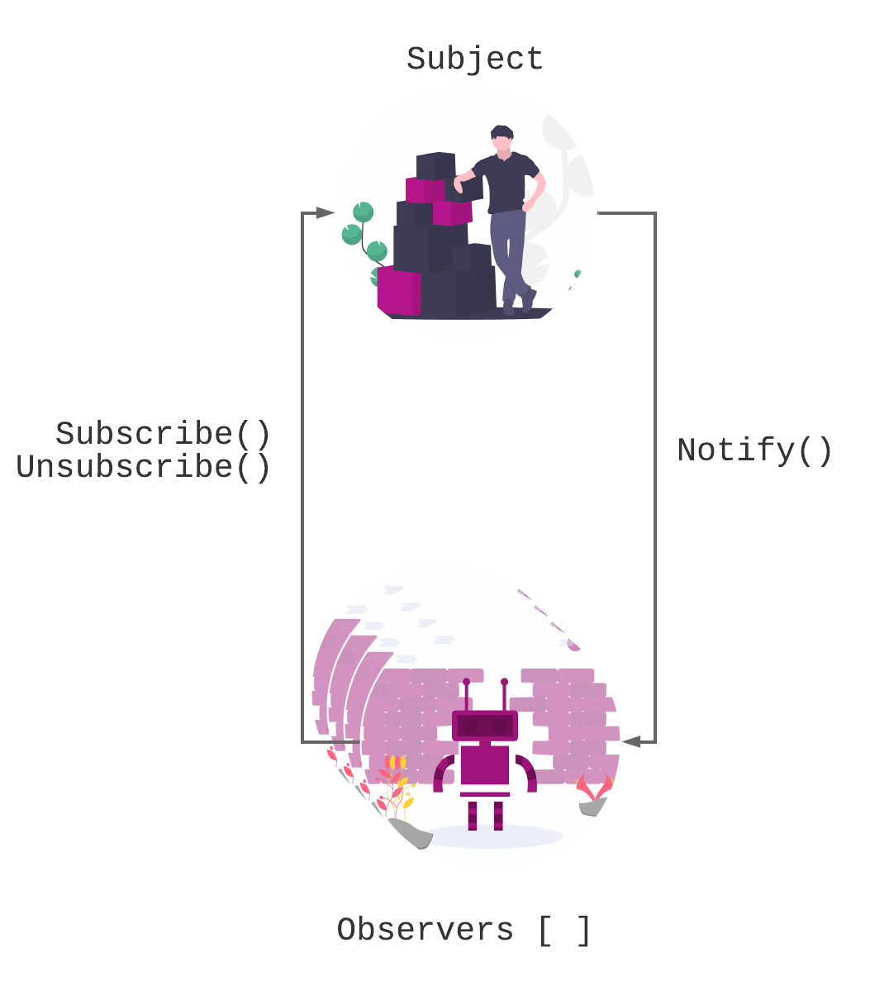
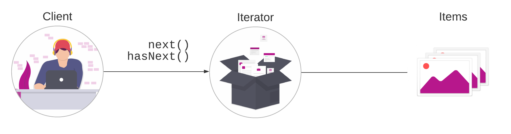

# Observable & Iterator pattern


Both are behavioral patterns.


## Observable pattern

### Short description

It defines a 1-to-many relationship of one subject and multiple observers where the subject notifies the observers when a state change occurs.

### How does it look?



### How does it look in code?



```javascript
const subject = new Subject();
const observer1 = new Observer(data=>console.log("observer 1: ", data));
const observer2 = new Observer(data=>console.log("observer 2: ", data));
const observer3 = new Observer(data=>console.log("observer 3: ", data));

subject.subscribe(observer1);
subject.subscribe(observer2);
subject.subscribe(observer3);

subject.notify("Hi Globatrix");
subject.notify("Bye Globatrix");

subject.unsubscribe(observer1);
subject.unsubscribe(observer2);
subject.unsubscribe(observer3);

subject.notify(":(");


```



```javascript
class Subject {
  constructor() {
    this.observers = [];
  }

  subscribe(observer) {
    this.observers.push(observer);
  }

  unsubscribe(observer) {
    this.observers = this.observers.filter(obs=> obs !== observer)
  }

  notify(data) {
    if (this.observers.length > 0) {
      this.observers.forEach(observer => observer.callback(data));
    }
  }
}
```



```javascript
class Observer {
  constructor(callbackMethod) {
    this.callback = callbackMethod;
  }
}
export Observer;
```



## Iterator pattern

### Short description

The iterator pattern provides the client with a way of looping over a collection of objects.

### How does it look?



### How does it look in code?

```javascript

class Iterator{
  constructor(){
    this.items = [1, 2, 3, 4, 5];
    this.length = items.length;

  }
  //Your own next implementation. For this example I'm iterating 2 by 2;
  next(){
    if (!this.hasNext()) return;
    return items[index+=2];
  }
  hasNext(){
    return index < length;
  }
}

var iterator = new Iterator();

console.log(iterator.next()); // 1
console.log(iterator.next()); // 3
console.log(iterator.next()); // 5
console.log(iterator.next()); // null
```

## 📒 Additional Resources

1. [Observable pattern by Eric Fuller](https://webdevstudios.com/2019/02/19/observable-pattern-in-javascript/)
2. [Observable pattern by DoFactory](https://www.dofactory.com/javascript/observer-design-pattern)
3. [Observable pattern by Pawel Grzybek](https://pawelgrzybek.com/the-observer-pattern-in-javascript-explained/)
4. [Iterator pattern by DoFactory](https://www.dofactory.com/javascript/iterator-design-pattern)
5. [Iterator pattern by Luciano Mammino](https://loige.co/javascript-iterator-patterns/)

