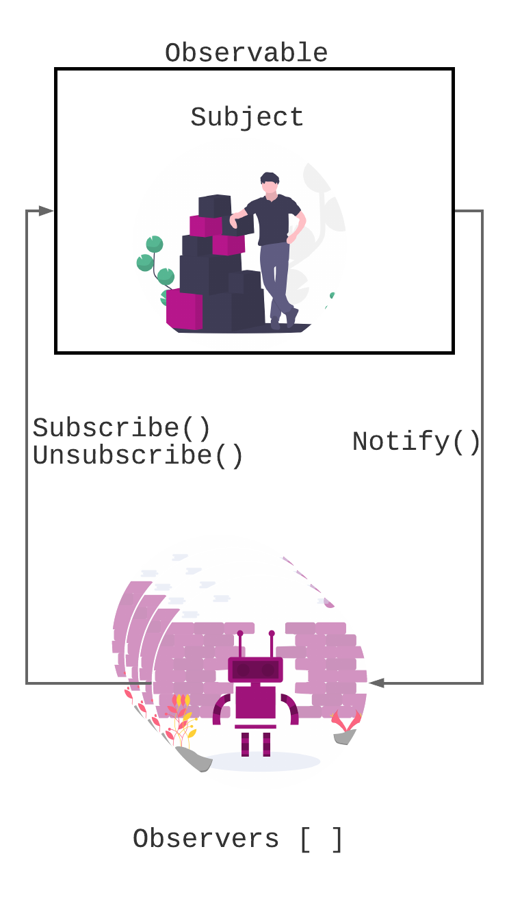

# Observables

## 🤖 How does it work?

From the [official documentation](https://rxjs-dev.firebaseapp.com/guide/observable):

> Observables are lazy Push collections of multiple values.

In simple words, the Observable for Rxjs is the handler for our Subject in the observable pattern. So, it will look like:



## 🤔 How to use it?

**To create** an observable, we have two methods:

1. Instantiate it with a _new_ keyword. It will need as a param a Subscriber. 
   1. What is a Subscriber? It is a helper to execute the observable.
2. Use a creation operator

```javascript
import { Observable } from 'rxjs';
import { someCreationOperator } from 'rxjs/operators';

const withNewKeyWord = new Observable(/*a subscriber method goes here*/);
const withOperator = someCreationOperator(someInput);
```

**To subscribe** we just need to call the _subscribe_ method. This method will execute the Subscriber that we pass as input. The _subscribe_ method has three parts.

1. **onNextCallback:** this callback will be executed per each item on the stream 
2. **onErrorCallback:** this one is to handle in an error occurs.
3. **onCompleteCallback:** this is the equivalent to the _finally_  callback in promises. This will be executed if the observable execute successfully al the item on the stream.

```javascript
import { Observable } from 'rxjs';

const observable = new Observable(function (subscriber){
    subscriber.next(1);
    subscriber.next(2);
    subscriber.next(3); 
    subscriber.complete();
} );


observable.subscribe( 
  /*onNext*/item => console.log("Next: ", item),
  /*onError*/err => console.error("Error: ", err),
  /*onComplete*/() => console.log("Completed ;)")
  );
```

**To dispose** and observable we just need to call the _unsubscribe_ method. Do **not forget** to unsubscribe.

```javascript
import { Observable } from 'rxjs';

const observable = new Observable(/*subscriber*/);


observable.subscribe( /*callbacks*/ );

observable.unsubscribe();
```

## 📒 Additional Resources

* [Official documentation - Observables](https://rxjs-dev.firebaseapp.com/guide/observable)
* [Angular observables guide](https://angular.io/guide/observables)


