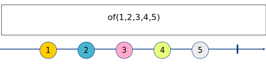
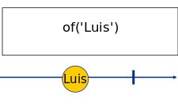

# of

## 🔑 Signature

From official documentation:

```javascript
of<T>(...args: Array<T | SchedulerLike>): Observable<T>
```

Friendly signature:

```javascript
of(...itemsToStream, scheduler?)
```

## 📖 Important notes


It's used to emit values from static data..



It emits directly the method arguments.



This operator does not perform any type of flattering.



It automatically complete the subscription when all the items were emitted 


## 🤔 How to use it?

```javascript
import { of } from 'rxjs';

const observer = {
    next: val => console.log('next', val),
    error: err => console.log('error', err),
    complete: () => console.log('complete!')
};

const source$ = of(1,2,3,4,5);

source$.subscribe(observer);
```



## 🕵 Common questions

### When using arrays



#### What will be the output?

```javascript
import { of } from 'rxjs';

const observer = {
    next: val => console.log('next', val),
    error: err => console.log('error', err),
    complete: () => console.log('complete!')
};

const source$ = of([1,2,3,4,5]);

source$.subscribe(observer);
```



```text
next ▶[1, 2, 3, 4, 5]
complete!
```



The _of_ operator does not have flattering. So, it would emit the array as an array. The same thing happens with the strings.





### When using multiple input types



#### What will be the output?

```javascript
import { of } from 'rxjs';

const observer = {
    next: val => console.log('next', val),
    error: err => console.log('error', err),
    complete: () => console.log('complete!')
};

const source$ = of("Perú", [28, 7, 1821], {independent: true}, function(){return "In Lima"});

source$.subscribe(observer);
```



```text
next Perú
next ▶[28, 7, 1821]
next ▶{independent: true}
next ▶ƒ ()
complete!
```



The _of_ operator will emit the same static data that we use as param. No matters the type.




